Pytorch Implementation of REAL-NVP . Based on the paper:

  > [Density estimation using Real NVP]https://arxiv.org/abs/1605.08803)\
  > Laurent Dinh, David Krueger, Yoshua Bengio\
  > arXiv:1605.08803

Final samples can be found in the `_samples` folder.

## MNIST
### Epoch 1

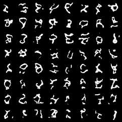

### Epoch 10

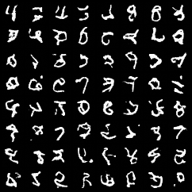

### Epoch 20

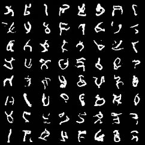

### Epoch 50

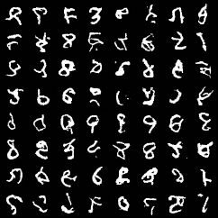

## FAHSION_MNIST

### Epoch 1

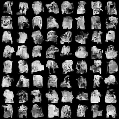

### Epoch 10

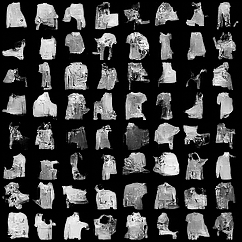

### Epoch 20

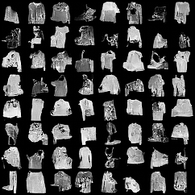

### Epoch 50

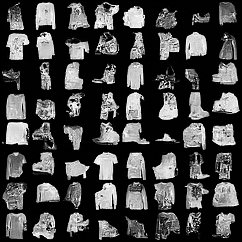

## CIFAR10

### Epoch 1

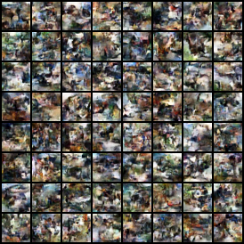

### Epoch 10

### Epoch 20

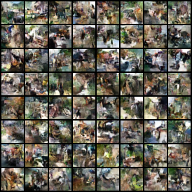

### Epoch 30

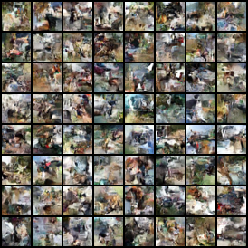

## Usage
The entire code is self contained in the Jupyter notebook,just run the cells sequentially. It is made this way for ease of training on Google Colab.